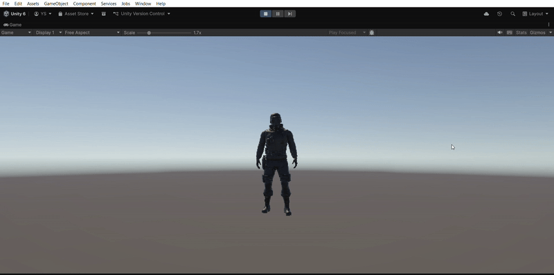

# Unity Mini-Project: Character & Animations

A study project developed with Unity 6.2. The primary focus is on character importing, Rigging configuration, and working with animations via Animator Controller.

## 🎯 Project Goals
* Import 3D models from external sources (Mixamo).
* Configure Humanoid Rig and Avatar settings.
* Implement a basic animation cycle (Idle, Walk, Run).

## 🛠 Technologies & Tools
* **Engine:** Unity 6.2
* **Character:** Model by Mixamo.
* **Animations:** "Human Basic Motions FREE" pack by Kevin Iglesias.
* **Version Control:** Git + GitHub Desktop + Git LFS.
* **Logic:** Configured **Animator Controller** with state transitions.

## 📸 Screenshots / Demo

## 📖 How to Run
1. Clone the repository: 
   `git clone https://github.com/YuliyaSerzhantova/Unity-Animator-Character-Rigging-Study.git`
2. Open the project folder via **Unity Hub**.
3. Ensure you are using **Unity 6.2** or a later version.
